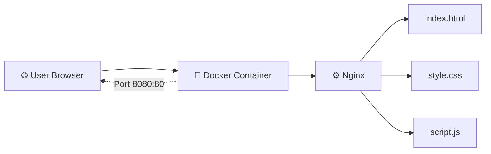

# 🏋️ Dockerized Gym Website

Modern responsive gym website built with **Docker + Nginx**.

## 📸 Homepage Preview


A modern responsive gym landing page created as a DevOps practice project and served with Nginx inside a Docker container.

## ✨ Features

- 🚀 Fully Dockerized Static Website
- 🌐 Hosted with Nginx
- 📱 Responsive Design
- 🎨 Modern Dark UI
- ⚡ Fast Static Asset Delivery
- 🐳 Docker Container Deployment


## 🛠️ Tech Stack

| Technology | Purpose |
|------------|---------|
| Docker | Containerization |
| Nginx | Static Web Server |
| HTML5 | Structure |
| CSS3 | Styling |
| JavaScript | Animations & Interactions |
| Linux | Deployment Environment |

## 🏗️ Architecture



### Request Flow

```text
User Browser
     ↓
localhost:8080
     ↓
Docker Container
     ↓
Nginx :80
     ↓
HTML / CSS / JavaScript
```

## 🐳 Run Locally with Docker

### Build Docker Image

```bash
docker build -t gym-website .
```

### Run Docker Container

```bash
docker run -d --name gym-website -p 8080:80 gym-website
```

### Stop Container

```bash
docker stop gym-website
```

### Remove Container

```bash
docker rm gym-website
```
