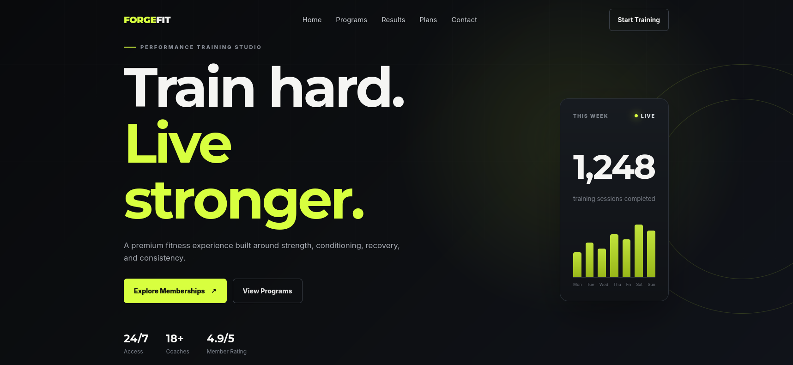
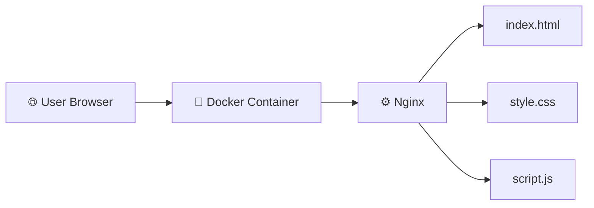

# 🏋️ Dockerized Gym Website

Modern responsive gym website built with **Docker + Nginx**.

## 📸 Homepage Preview



## ✨ Features

- 🚀 Fully Dockerized Static Website
- 🌐 Nginx Web Server
- 📱 Responsive Design
- 🎨 Modern Dark UI
- ⚡ Fast Static Asset Delivery
- 🐳 Docker Container Deployment

## 🛠️ Tech Stack

| Technology | Purpose |
|------------|---------|
| Docker | Containerization |
| Nginx | Static Web Server |
| HTML5 | Website Structure |
| CSS3 | Styling |
| JavaScript | Animations & Interactions |
| Linux | Deployment Environment |

## 🏗️ Architecture



## 📂 Project Structure

```text
dockerized-gym-website/
│
├── index.html
├── style.css
├── script.js
├── Dockerfile
├── nginx.conf
├── README.md
├── .gitignore
│
└── screenshots/
    └── homepage.png
```

## 🔄 Request Flow

```text
User Browser
     ↓
localhost:8080
     ↓
Docker Container
     ↓
Nginx :80
     ↓
HTML / CSS / JavaScript
```

## 🧠 What I Learned

Through this project, I practiced:

- Creating and running Docker containers
- Building Docker images
- Docker port mapping
- Serving a static website using Nginx
- Working with Docker on RHEL 9
- Managing projects with GitHub
- Writing project documentation in Markdown
- Troubleshooting Docker and networking issues

## 🔧 Troubleshooting

### Check Running Containers

```bash
docker ps
```

### Check Container Logs

```bash
docker logs gym-website
```

### Check Port Mapping

```bash
docker port gym-website
```

### Test the Website

```bash
curl http://127.0.0.1:8080
```

## 🚀 Deployment Flow

```text
Website Source Code
        ↓
    Dockerfile
        ↓
   Docker Image
        ↓
 Docker Container
        ↓
      Nginx
        ↓
   Port 8080
        ↓
   Web Browser
```

## 🐳 Run Locally with Docker

### Build Docker Image

```bash
docker build -t gym-website .
```

### Run Docker Container

```bash
docker run -d --name gym-website -p 8080:80 gym-website
```

### Stop Container

```bash
docker stop gym-website
```

### Remove Container

```bash
docker rm gym-website
```

## 🌐 Live Demo

[View Live Website](https://vikaschauhan-devops.github.io/dockerized-gym-website/)

## 📌 Project Highlights

This project demonstrates basic DevOps workflow including:

- Containerization with Docker
- Nginx web server deployment
- Linux-based troubleshooting
- GitHub repository management
- GitHub Pages deployment
